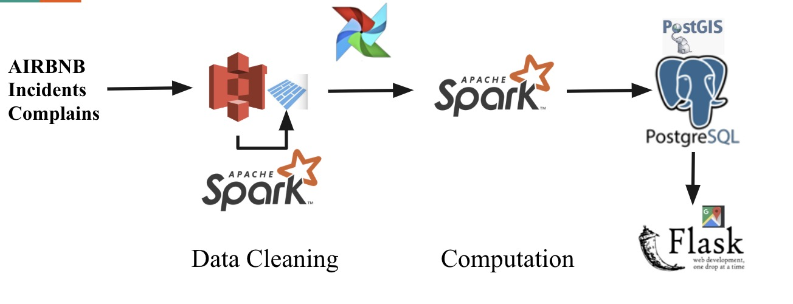

# Tonebnb
This is a project I completed during the Insight Data Engineering program (Silicon Valley, Fall 2019). Visit dataharbor.club:5001 to see it in action.

This project aims at providing the history safety related information of locations and adjusted rating scores of airbnb listings to travellers who are booking from a place they are not familiar with, so they can book fast and informed.

The background of the UI is a heatmap with aggregated data from the specific city's public incidents and complains datasets, it presents the safety related information of a location, in this project, it's "The Tone of a Location"; The Airbnb listings' color changed according to the adjusted score, the brighter th color, the higher the score. When a listing is clicked, all incidents happened around within a specific time window and scope will display.


## Pipeline
Clean Job: 

Computation Job: 


## Dataset
Safety related data: (take San Francisco as an example)

Incidents data: from 2003~present: ~3m

311 Complains data: from ... ~present ~3.6m

airbnb history listing data: (All available cities of the U.S. and Canada: ~100GB)

dataset download:
airbnb script

## Environment Setup
Please refer to ... for installation and configuration details for Java, Spark, PostgreSQL, postGIS, Flask, Airflow
address every instructions seperately: spark, db, airflow, in different docs

## CLUSTER STRUCTURE:
To reproduce my environment, 6 m4.large AWS EC2 instances are needed:

(6 nodes) Spark Cluster - Batch

PostgreSQL sits in Mater's node

Flask is in Mater's node

## Access S3 from Spark
Add the following configuration in `$SPARK_HOME/conf/spark-defaults.conf`
```ini
spark.hadoop.fs.s3a.access.key=MY_ACCESS_KEY
spark.hadoop.fs.s3a.secret.key=MY_SECRET_KEY
spark.hadoop.fs.s3a.impl=org.apache.hadoop.fs.s3a.S3AFileSystem
```
Add the following 3rd party library into `$SPARK_HOME/lib/`
```bash
$ cd $SPARK_HOME/lib/
$ wget ...
```

## Running Tonebnb

## Caveat
- At this time of writing, pyspark can work with only Java 8. Make sure spark env is Java 8.
